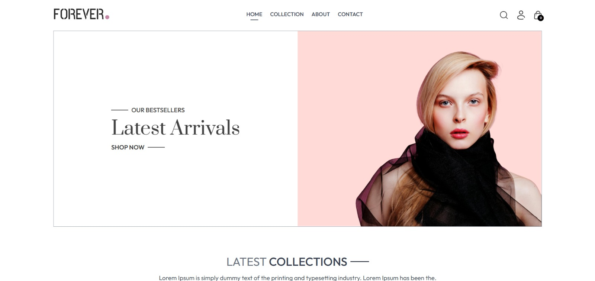
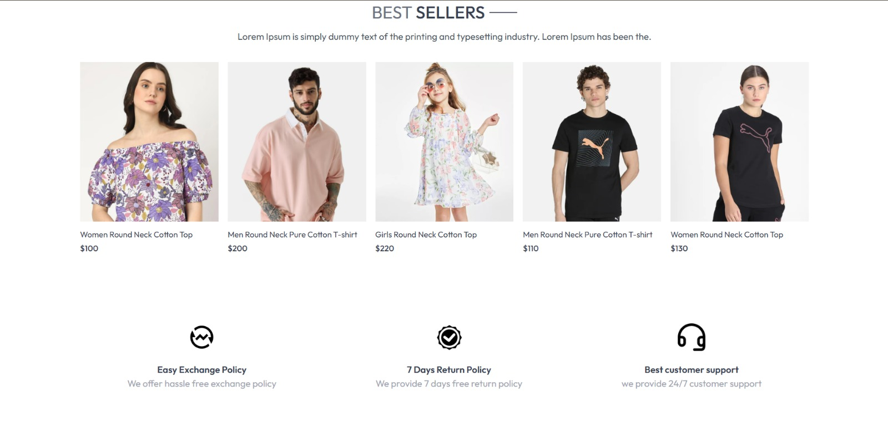
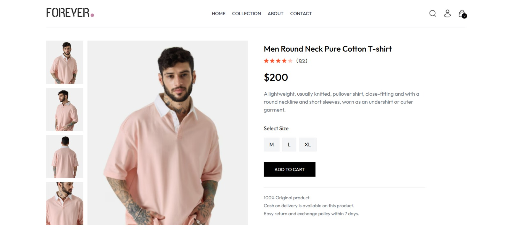

# 🛍️ Forever E-Commerce Website

## 🧾 Overview
A responsive and user-friendly E-Commerce website built with modern front-end technologies. The platform features essential e-commerce functionalities like product listing, shopping cart, checkout, and user experience enhancements. Developed as part of a project to deepen front-end development skills and create a seamless online shopping experience.

## ✨ Features
- Responsive and clean UI using **Tailwind CSS**
- Product listing with dynamic layout
- Smooth navigation through Home, Product, Cart, and Checkout pages
- Interactive shopping cart with real-time updates
- Designed for cross-device compatibility
- Enhanced user experience with smooth transitions and clean layout

## 📸 Screenshot

## 🔗 Live Link
- Live Site URL: [Forever eCommerce Website](https://forever-theta-gold.vercel.app/)

## 🛠️ Built With
- 💻 **HTML**
- 🎨 **CSS**
- ⚙️ **JavaScript**
- 🌈 **Tailwind CSS**

## 👨‍💻 Author

- **Name:** Nidhi Ramteke
- **LinkedIn:** [@nidhiramteke](https://www.linkedin.com/in/nidhi-ramteke-24nr/)
- **GitHub:** [@nidhiramteke011](https://github.com/nidhiramteke011)
